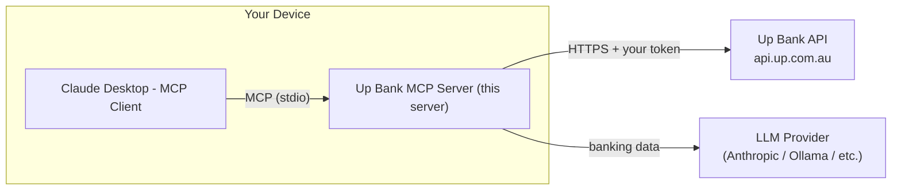

# Up Bank MCP (Unofficial)

MCP server exposing the full Up Bank API as tools — balances, transactions, categories, tags, webhooks.
https://developer.up.com.au/

## Architecture

This server runs **locally on your device**. All requests to the Up Bank API are made directly from your machine — your personal access token never leaves your device and is never sent to a third party.

However, to answer your questions, the LLM you connect this server to will retrieve your banking data (account balances, transactions, etc.) and include it in the conversation. This data is sent to whichever LLM provider you are using (e.g. Anthropic's servers if using Claude). You should be comfortable with your LLM provider's data handling and privacy policy before using this tool.

**For complete privacy**, consider connecting to a locally running LLM such as [Ollama](https://ollama.com), which keeps all data — your token, your banking data, and your conversation — entirely on your own device.



## Tools

| Tool | Description |
|---|---|
| `ping` | Verify token and API connectivity |
| `list_accounts` | List all accounts (filter by type/ownership) |
| `get_account` | Get a single account by ID |
| `list_transactions` | List transactions across all accounts (auto-paginated) |
| `get_transaction` | Get a single transaction by ID |
| `list_account_transactions` | List transactions for a specific account (auto-paginated) |
| `list_categories` | List all spending categories |
| `get_category` | Get a single category by ID |
| `update_transaction_category` | Set or clear the category on a transaction |
| `list_tags` | List all tags (auto-paginated) |
| `add_tags_to_transaction` | Add tags to a transaction |
| `remove_tags_from_transaction` | Remove tags from a transaction |
| `list_attachments` | List all receipt attachments (auto-paginated) |
| `get_attachment` | Get a single attachment by ID |
| `list_webhooks` | List configured webhooks |
| `get_webhook` | Get a single webhook by ID |
| `create_webhook` | Create a new webhook |
| `delete_webhook` | Delete a webhook |
| `ping_webhook` | Send a test ping to a webhook |
| `list_webhook_delivery_logs` | Get delivery history for a webhook |

## Setup

### Option 1 — Claude Desktop (MCPB bundle, recommended)

1. Get your Up Bank token from [api.up.com.au](https://api.up.com.au)
2. Drag `up-bank-mcp.mcpb` onto Claude Desktop Extensions Window
3. Enter your token in the install dialog — stored securely in your OS keychain
4. Done — no Python required (automatically handled by uv in Claude Desktop)

To rebuild the bundle after making changes:
```bash
mcpb pack
```

### Option 2 — Any MCP client (manual config)

Add to your MCP client's config (e.g. Claude Desktop `claude_desktop_config.json` or Claude Code):

```json
{
  "mcpServers": {
    "up-bank": {
      "command": "uv",
      "args": ["--directory", "/path/to/up-bank-mcp", "run", "python", "server/main.py"],
      "env": {
        "UP_PAT": "up:yeah:your-token-here"
      }
    }
  }
}
```

### Option 3 — Run directly

```bash
cd up-bank-mcp
export UP_PAT="up:yeah:your-token-here"
uv run python server/main.py
```

## Auth

All options use the `UP_PAT` environment variable. Get your token at [api.up.com.au](https://api.up.com.au) — it looks like `up:yeah:xxxxxxxxxxxx`.

## Development

### Prerequisites

**uv** — Python package manager (replaces pip + venv):
```bash
curl -LsSf https://astral.sh/uv/install.sh | sh
```

**mcpb** — MCP bundle CLI:
```bash
npm install -g @anthropic-ai/mcpb
```

**Node.js** is required for mcpb. Install via [nodejs.org](https://nodejs.org) or `brew install node`.

### Run locally

```bash
cd up-bank-mcp
uv sync                            # install dependencies into .venv
export UP_PAT="up:yeah:your-token-here"
uv run python server/main.py       # start the MCP server over stdio
```

To test interactively with the MCP inspector:
```bash
npx @modelcontextprotocol/inspector uv run python server/main.py
```

### Pack the MCPB bundle

```bash
mcpb validate manifest.json        # check manifest against schema
mcpb pack                          # produces up-bank-mcps.mcpb
```

The `.mcpb` file can be dragged into Claude Desktop to install. Re-pack after any code changes before distributing.

## Releasing a new version

1. Bump the version in `manifest.json` and `pyproject.toml` (e.g. `0.1.0` → `0.2.0`)

2. Pack a new bundle:
```bash
mcpb pack
```

3. Create a GitHub release and attach the bundle:
```bash
gh release create v0.2.0 ./up-bank-mcp.mcpb \ 
  --title "v0.2.0" \
  --notes "Describe what changed."
```

4. Update the version and release date in `docs/index.html`:
```html
<!-- Find this line in the download button section and update it -->
<div style="...">v0.2.0 · Released 15 June 2026</div>
```

5. Add an entry to `CHANGELOG.md`:
```markdown
## [v0.2.0] — 15 June 2026

### Added
- ...

### Fixed
- ...

[v0.2.0]: https://github.com/fane-ye/up-bank-mcp/releases/tag/v0.2.0
```

The download URL in `docs/index.html` uses `/releases/latest/download/` so it always points to the newest release automatically — only the version label and date need updating manually.